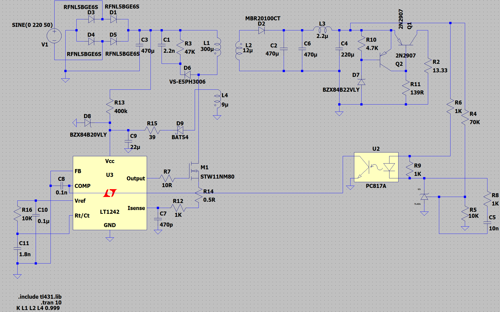
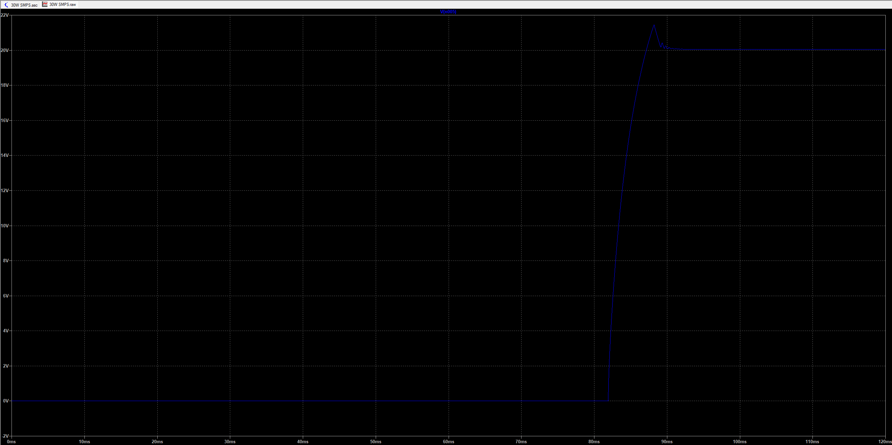
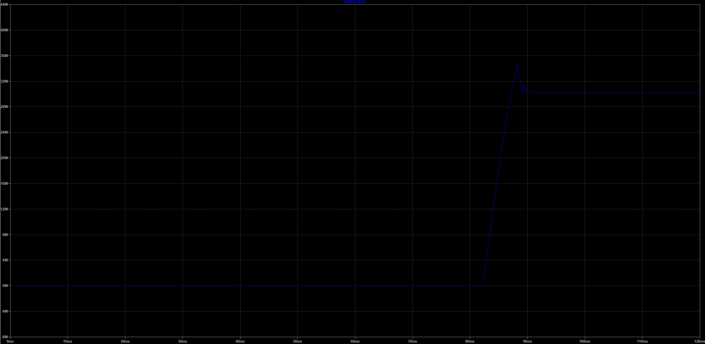
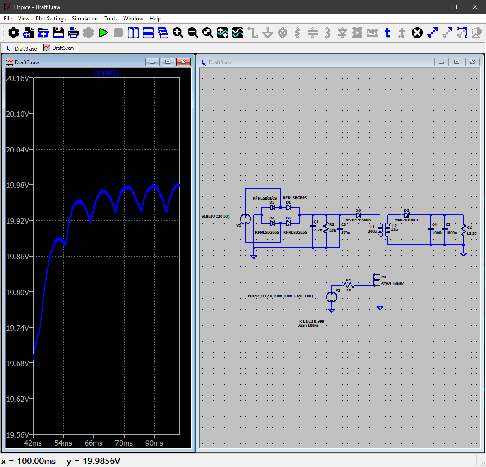
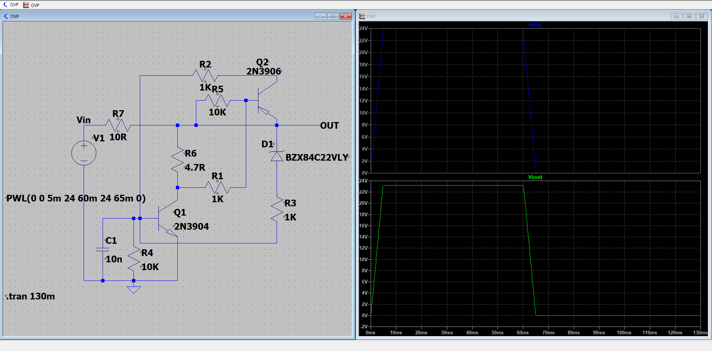
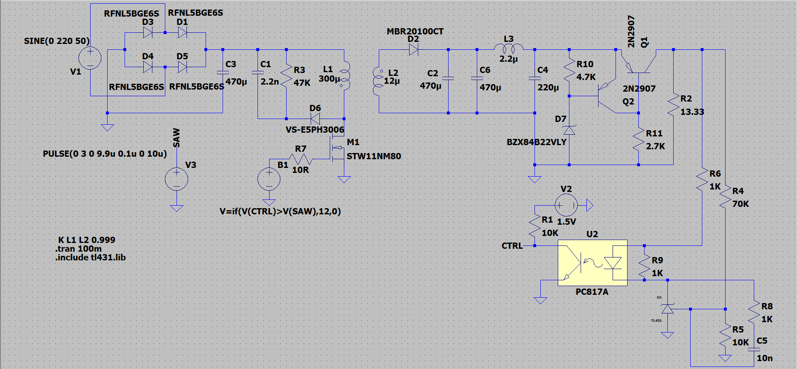

# 30 W Offline Flyback Charger

A 30 W isolated AC-DC flyback converter designed from first principles and
validated in LTspice. Mains input, 20 V at 1.5 A out, with optocoupler
feedback, an RCD clamp and output overvoltage protection. Closed loop
regulates to 20.05 V, with a startup overshoot that is characterised below
and not yet fixed.

**Status:** Simulation stage. No board built.
**Tools:** LTspice 26.0.1, Excel

## Specification

| Parameter | Value |
|---|---|
| Input | 220 V, 50 Hz sine source |
| Output | 20 V at 1.5 A, 13.33 Ω load |
| Output power | 30 W |
| Topology | Isolated flyback, discontinuous conduction |
| Primary inductance | 300 µH |
| Secondary inductance | 12 µH |
| Coupling coefficient | 0.999 across primary, secondary and auxiliary |
| Turns ratio | 5:1 |
| Isolation | Optocoupler feedback, no galvanic path across the barrier |

## What is in this repository

| Path | Contents |
|---|---|
| `simulation/flyback-30w.asc` | Full converter, LTspice |
| `simulation/ovp.asc` | Output overvoltage protection, simulated separately |
| `simulation/window-voltage-protection.asc` | Input window detector, abandoned, see below |
| `simulation/results/` | Exported simulation captures |
| `docs/transformer-calculator.xlsx` | Transformer sizing spreadsheet |
| `images/schematic-full.png` | Readable export of the full schematic |

Note on revisions: the schematic image above is a later capture than the
`.asc` file in `simulation/`. The topology is identical; a handful of
component values were still being trimmed between the two, including the
output capacitor and the feedback divider. The `.asc` is the last saved
simulation file.

## Design approach

The converter is a single-switch isolated flyback running in discontinuous
conduction. Flyback was chosen over forward or resonant topologies because
at 30 W it needs one magnetic component and one switch, and isolation comes
free with the transformer rather than requiring a separate barrier.

### Switch selection and voltage stress

The switch sees the rectified bus plus the reflected output plus the leakage
spike. With a 5:1 turns ratio the reflected secondary voltage is about 100 V
on top of the rectified bus, before any clamp overshoot. An STW11NM80 rated
at 800 V was chosen to leave headroom for the leakage spike and for high-line
operation rather than sizing to the nominal case.

Gate drive is through a 10 Ω series resistor, slowing the edge enough to
reduce ringing without pushing switching loss up unnecessarily.

### Leakage energy

Transformer leakage cannot couple to the secondary, so it has to go
somewhere at turn-off or it appears across the switch. An RCD clamp of
2.2 nF and 47 kΩ through a VS-E5PH3006 ultrafast diode catches that energy
and bleeds it through the resistor. The capacitor is rated 450 V because it
sits at the drain node.

### Feedback loop

Regulation is closed around a TL431 shunt reference driving a PC817
optocoupler into an LT1242 current-mode controller. The output divider is
75 kΩ over 10.135 kΩ, which with the TL431 2.5 V reference sets the output
in the 20 V region. Compensation sits on the TL431 cathode, a 10 kΩ and
1.8 nF series network with 0.1 nF across it for high-frequency rolloff.

The optocoupler is what keeps the control loop isolated. Nothing crosses the
barrier except light.

### Output stage

An MBR20100CT Schottky rectifies the secondary. Bulk output capacitance is
470 µF and 200 µF with a 2.2 µH inductor between them, giving a second-order
post-filter to pull down the switching ripple that the bulk capacitor ESR
leaves behind.

### Overvoltage protection

If the feedback loop opens, the output runs away. A 22 V zener
(BZX84B22VLY) into the base of a 2N2907 pulls the output down once it passes
threshold, giving a hard limit that does not depend on the loop being
healthy. Simulated separately in `ovp.asc`.

## Simulation results

### Closed-loop startup

| Parameter | Value |
|---|---|
| Steady-state output | 20.05 V |
| Steady-state power | 30.2 W |
| Peak output during startup | 21.4 V |
| Peak power during startup | 34.5 W |
| Overshoot | 7 percent |
| Settled by | Roughly 11 ms after switching begins |

Regulation is good. The output overshoots once, rings down, and is flat
inside about 11 ms, and steady state lands 0.25 percent above target. A
single overshoot with a clean damped settle says the compensation network is
doing its job.

The flat section before 82 ms is the controller waiting on its own supply.
Vcc charges from the rectified bus through a startup resistor into a 100 µF
capacitor, so nothing switches until that crosses the UVLO threshold.

### The startup overshoot is a real defect, not a simulation artefact

21.4 V into a 13.33 Ω load is 34.5 W on a converter rated at 30 W, and it
happens on every power-up. For a 20 V USB-C PD output, where the profile is
specified at plus or minus 5 percent, 21.4 V is outside the window the
device on the other end of the cable is entitled to expect. The 22 V
overvoltage trip sits above the excursion and never fires.

The cause is visible in the ramp. The output rises 0 to 20 V in about 6 ms.
With roughly 1160 µF of output capacitance that is about 23 mC of charge, so
an average of nearly 4 A into the capacitors against a 1.5 A rating. The
converter spends the entire ramp against its current limit, which means the
loop is saturated: the error amplifier is pinned at maximum demand and the
primary is carrying peak current. When the output reaches target there is
nothing holding it there until the amplifier unwinds, so it coasts past.

The fix is soft-start, ramping the current limit up from zero over tens of
milliseconds at the controller's compensation pin so the output charges
slowly enough for the loop to stay linear throughout. That is the next
change to the design, and it does not require touching the compensation
network, which is behaving correctly.

### Power stage, open loop

Earlier open-loop run with the gate driven at a fixed 18.5 percent duty from
a pulse source, 1.85 µs on-time in a 10 µs period, into the same load. The
output settles at 19.99 V with roughly 50 mV of ripple.

This was the check that the power stage was right before the control loop
went anywhere near it. Getting the transformer, clamp and output filter to
produce the correct voltage at a known duty first means anything odd after
closing the loop is the loop's fault, not the magnetics.

### Overvoltage protection

The protection circuit tested on its own, with the input ramped up to 24 V
and back down through a piecewise-linear source over a 130 ms transient. The
22 V zener into the transistor pair sets the trip point.

Testing it standalone rather than inside the converter was deliberate. In the
full circuit a protection trip and a loop transient look similar on the
output node, so isolating it is the only way to know the trip point is where
the divider says it is.

## Design decisions and dead ends

**PWM built behaviourally before a controller IC went in.**

An earlier revision generated the gate drive from a sawtooth source and a
behavioural comparator, `V=if(V(CTRL)>V(SAW),12,0)`, with the optocoupler
pulling the control node. Real op-amps were tried first and did not work:
the slew rate was too slow to produce a clean edge at 100 kHz, and a faster
part had an input common-mode range that did not cover the operating point,
which showed up as phase inversion rather than as an obvious failure.

Rather than keep hunting for a comparator, the function was replaced with a
behavioural source so the rest of the converter could be verified, then a
real current-mode controller was dropped in once the power stage was known
good. The lesson worth keeping is that an op-amp datasheet headline figure
tells you very little about whether the part will work at the bias point you
are actually using it at.

**Window voltage detector, abandoned.** An input-range detector built from
two shunt references was intended to inhibit the converter outside a valid
input window. It is in `window-voltage-protection.asc`. The problem is that
the reference threshold and the drive current into it are coupled when the
network sits on a high-voltage rail, so the trip point moves with the thing
it is supposed to be measuring. It was dropped rather than forced, and the
overvoltage protection on the output covers the failure mode that actually
matters.

**Transformer calculator inputs do not match the final design.** The
spreadsheet in `docs/` was the sizing tool, and its stored inputs
(11.5:1 ratio, 147 µH primary) are from an earlier design point, not the
300 µH and 5:1 that the simulation ended up using. It is included because
the method is the useful part: primary inductance from power and duty,
secondary from the turns ratio, turns from core area and peak flux density,
then air gap from the AL value needed to land on that inductance. The
switching frequency cell is also stale.

## Key components

| Reference | Part | Why |
|---|---|---|
| M1 | STW11NM80 | 800 V, sized for reflected voltage plus leakage spike rather than nominal bus |
| D1, D3, D4, D5 | RFNL5BGE6S | Input bridge rectifier |
| D6 | VS-E5PH3006 | Ultrafast clamp diode, has to recover faster than the leakage spike |
| D2 | MBR20100CT | Schottky output rectifier, low forward drop at 1.5 A |
| U1 | LT1242 | Current-mode PWM controller |
| U2 | PC817 | Optocoupler, isolates the feedback path |
| U3 | TL431 | Shunt reference and error amplifier |
| D7 | BZX84B22VLY | 22 V zener, output overvoltage trip |

## Outstanding work, in order:

1. Add soft-start and re-run, to remove the 7 percent startup overshoot and
   bring peak power inside the 30 W rating.
2. Load-step response. Startup is characterised, step response is not.
3. Reconcile the transformer calculator with the final design point.
4. Take the design through schematic capture and PCB layout.

## Licence

MIT. See [LICENSE](LICENSE).
